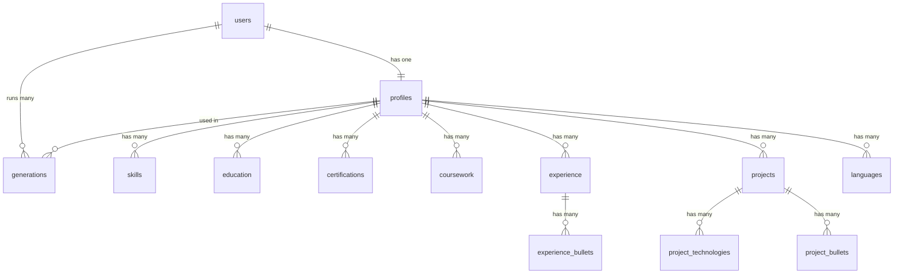

# Database Design — AFNOCV

MySQL/MariaDB schema, hosted on Hostinger. Source of truth for the actual `CREATE TABLE` statements is [`db/schema.sql`](../db/schema.sql) — this doc explains *why* each table and column exists, for anyone (human or AI) picking up the project cold.

## Diagram

## Tables

### `users`
One row per account. Holds only what's needed to authenticate — nothing about the resume itself lives here.

| Column | Why |
|---|---|
| `email` | Login identifier, unique. |
| `password_hash` | Never store plaintext passwords — this holds a bcrypt (or similar) hash. |

### `profiles`
One row per user (1:1, enforced by `user_id UNIQUE`) — the resume intake data (personal info + summary). Everything else (education, experience, etc.) hangs off this table via `profile_id`, not `user_id` directly, so a user's data is always reached through their profile — keeps the "a profile is the resume source-of-truth" boundary explicit rather than scattering `user_id` across every child table.

`contact_email` is deliberately separate from `users.email` — the email someone logs in with isn't always the email they want a recruiter to see on their resume.

### `skills`
One row per skill, tagged with a fixed `category` (`ENUM('Programming Languages', 'Frameworks/Tools')`). Kept flat rather than a separate `skill_categories` join table because the app deliberately locked skills to exactly these two categories (see `docs/PROJECT.md` decisions log) — a join table would model a many-valued relationship that doesn't exist here.

### `education`, `certifications`, `coursework`, `languages`
Straightforward one-to-many children of `profiles`. Date fields (`start_date`, `end_date`) are `VARCHAR`, not `DATE` — the app's schema intentionally allows free text like `"December 2026 (Expected)"`, which a real `DATE` type can't hold.

### `experience` / `experience_bullets`
Split into two tables because a work-experience entry has a variable number of bullet points (the AI rewrites/adds to these later). One row per bullet keeps that list ungoverned by any fixed size.

### `projects` / `project_technologies` / `project_bullets`
Same reasoning as experience: technologies and description bullets are both variable-length lists per project, so each gets its own child table.

### `generations`
One row per "Generate Resume" run — the record of what the AI produced for a given `(profile, resume_type)` combination. There's no `job_description` reference — see "Deliberate omissions" below.

| Column | Why |
|---|---|
| `resume_type` | The four modes from the product design: `max_match`, `ultra_match`, `basic_match`, `natural` — how aggressively the AI tailors the resume to the JD. |
| `generated_json` | The AI's structured output (tailored bullets, reordered skills, keyword alignment) stored as JSON rather than normalized into rows. Rationale: this data is generated and replaced wholesale each run, never edited field-by-field or queried by individual sub-fields — normalizing it would add many tables for no real benefit. |
| `match_score` | Filled in later by the hand-written cosine-similarity feature; nullable because it's computed after generation, not during. |

## Deliberate omissions

- **No `job_descriptions` table, and no job-description text anywhere in the schema.** The dashboard's "Generate" button sends the pasted JD straight through to the LLM call and the match-score calculation within a single request/response cycle, then the text is discarded — never written to the database. Trade-off: there's no history of "which JD produced this generation," and re-running a past generation against the same JD means re-pasting it. Chosen deliberately for simplicity; can be added later as a `job_description_text` column on `generations` (or a full table again) if history/re-run matters later.
- **No `sessions` table.** Auth will use stateless tokens (JWT) rather than server-side sessions, so there's nothing to persist for login state. If that changes later, a `sessions` table can be added without touching anything above.
- **No password-reset / email-verification tables.** Out of scope for now — flagged as a gap, not an oversight, if the product ever needs them.
